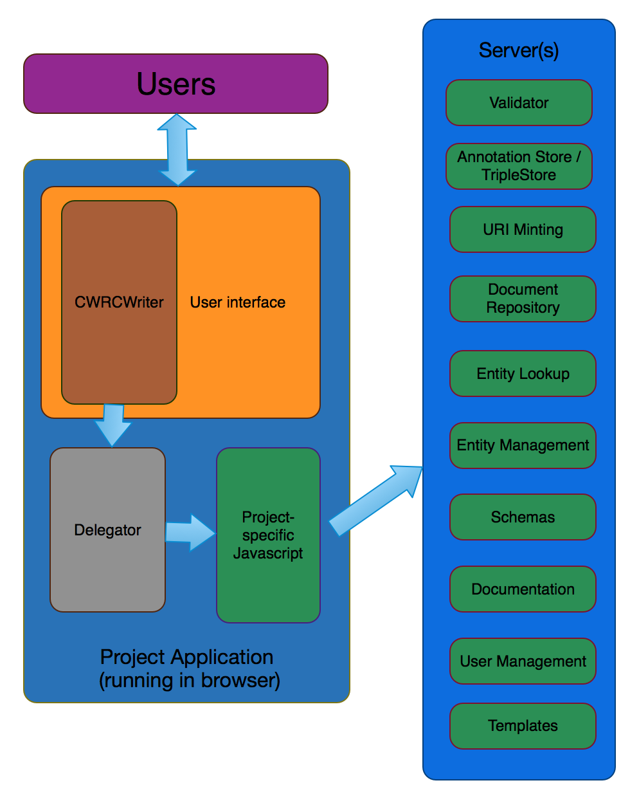
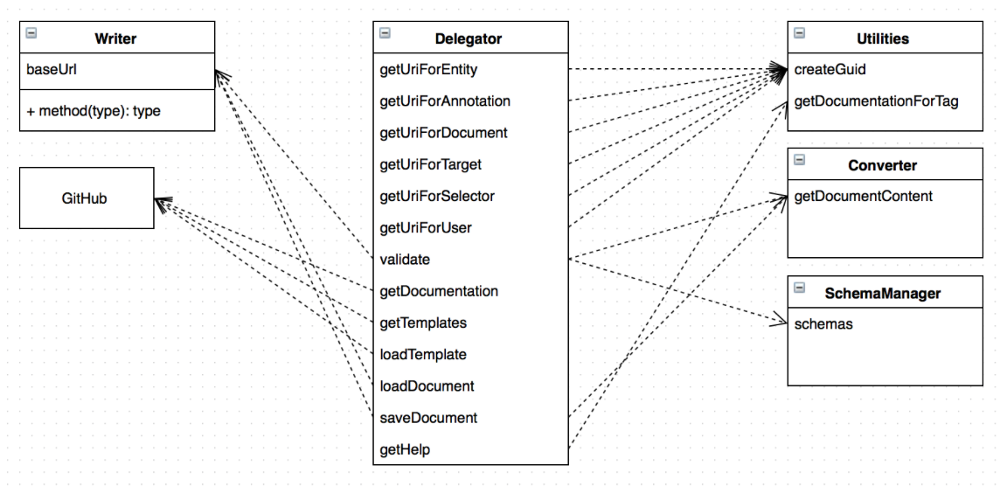

CWRC-Writer
===========

The Canadian Writing Research Collaboratory (CWRC) is developing an in-browser text markup editor (CWRC-Writer) for use by collaborative scholarly editing projects.  [Project Site](http://www.cwrc.ca/projects/infrastructure-projects/technical-projects/cwrc-writer/)


## Table of Contents

1. [Overview](#overview)
1. [Setup](#setup)
1. [Configuration](#overview)
1. [Usage](#usage)
1. [Customization](#customization)
1. [Demo](#demo)
1. [Contributing](#contributing)
1. [FAQ](#faq)
1. [License](#license)


## Overview

CWRCWriter is a wysiwyg text editor for in-browser XML editing and stand-off RDF annotation.  The editor is a [JQuery](https://jquery.com) customization of the [TinyMCE](http://www.tinymce.com) editor.  CWRCWriter requires several (not provided) supporting services: 

  * document store, to list/retrieve/save/delete/update XML documents
  * annotation store, to list/retrieve/save/delete/update RDF annotations
  * XML validation service
  * authentication/authorization, as needed
  * entity management service, to lookup/add/edit entities (people,places,events)
  * XML schemas 
  * template service, to provide predefined XML templates 
  * documentation service, to provide help for various functions

The services are configured through a 'delegator' class to which the CWRCWriter makes predefined calls without any knowledge of the underlying implementation, allowing easier substitution of your own document store, etc.  If you have existing server-side services, you'll create a delegator to call out to your services.  You may alternatively create a delegator that implements some or all services in-browser.
Most of the work in setting up CWRCWriter for your project will be implementing a delegator, and the corresponding services if you don't already have them.  



**[Back to top](#table-of-contents)**

## Setup

### RequireJS

CWRC-Writer uses RequireJS to load its files. The dependencies are defined in https://github.com/cwrc/CWRC-Writer/blob/development/src/js/config.js. See https://github.com/cwrc/CWRC-Writer/blob/development/src/editor_dev.htm for a working example.

#### Set RequireJS baseUrl

```
require.config({baseUrl: 'js'});
```

#### Load the initial dependencies
```
require(['jquery', 'knockout'], function($, knockout) {
    window.ko = knockout; // requirejs shim isn't working for knockout
    
    require(['writer',
             'delegator',
             'jquery.layout',
             'jquery.tablayout'
    ], function(Writer, Delegator) {
        $(function() {
            // initialize the Writer
        });
    });
});
```

#### Initialize the Writer and any modules
```
writer = new Writer(config);
writer.init('editor');
writer.event('writerInitialized').subscribe(function(writer) {
  // load modules then do the setup
  require(['modules/entitiesList','modules/relations','modules/selection',
           'modules/structureTree','modules/validation'
  ], function(EntitiesList, Relations, Selection, StructureTree, Validation) {
    // initialize modules and do layout
  });
});
```

### Customize Layout

See https://github.com/cwrc/CWRC-Writer/blob/development/src/js/layout.js for an example of module initialization and layout.

### Delegate to your services

The bulk of the work in setting up the CWRCWriter is in the delegator.  The following UML diagram shows how the default CWRCWriter delegates for the CWRC project.  The methods that must be implemented for a new project are those in the 'delegator' class.



* `getUriForEntity(searchString)`: The lookup call to find an entity identifier (URI) in the entity database.  An entity can be a person, place, event.
  * Returns: A URI for the selected entity.
* `getUriForAnnotation()`
* `getUriForDocument()`
* `getUriForTarget()`
* `getUriForSelector()`
* `getUriForUser()`
* `validate()`
* `getDocumentation()`
* `getTemplates()`
* `loadTemplates()`
* `loadDocument()`
* `saveDocument()`
* `getHelp()`

**[Back to top](#table-of-contents)**

## Configuration

### Writer Config options

* `config.cwrcRootUrl`: String. An absolute URL that should point to the root of the CWRC-Writer directory. <b>Required</b>.
* `config.mode`: String. The mode to start the CWRC-Writer in. Can be either `xml` or `xmlrdf`.
* `config.allowOverlap`: Boolean. Should overlapping entities be allowed initially?.
* `config.project`: String. Denotes the current project. Not currently used.
* `config.schemas`: Object. A map of schema objects that can be used in the CWRC-Writer. Each entry should contain the following:
  * `name`: The schema title.
  * `url`: An url that links to the actual schema (RELAX NG) file.
  * `cssUrl`: An url that links to the CSS associated with this schema.
  * `schemaMappingsId`: The directory name associated with this schema. This is used to load appropriate mapping and dialogs files from the schema directory: https://github.com/cwrc/CWRC-Writer/tree/development/src/js/schema
* `config.cwrcDialogs`: Object. Contains various urls for use by the [CWRC-Dialogs](https://github.com/cwrc/CWRC-Dialogs). See [writerConfig.js](https://github.com/cwrc/CWRC-Writer/blob/development/src/js/writerConfig.js) for an example.
* `config.buttons1`, `config.buttons2`, `config.buttons3`: String. A comma separated list of plugins that will be set in the toolbars in the CWRC-Writer. Some possible values are: `addperson, addplace, adddate, addorg, addcitation, addnote, addtitle, addcorrection, addkeyword, addlink, editTag, removeTag, addtriple, viewsource, editsource, validate, savebutton, loadbutton`.

### Configuration within documents

The CWRCWriter can be configured for individual documents by including configuration information in the documents themselves:  

1.  XML/RDF mode.  The default mode isXML & RDF with no overlap.

This can be overridden by a cw:mode setting in the RDF:

<rdf:Description rdf:about="http://localhost:8080/editor/documents/null">
    <cw:mode>0</cw:mode>
</rdf:Description>

where allowable values for cw:mode are:

0 = XML & RDF
1 = XML
2 = RDF

**[Back to top](#table-of-contents)**

## Usage

### XML/RDF modes

**[Back to top](#table-of-contents)**

## Customization

The CWRCWriter menus and layout can be customized.

**[Back to top](#table-of-contents)**

## Demo

**[Back to top](#table-of-contents)**

## Contributing

Please contact us, or open an issue.

**[Back to top](#table-of-contents)**

## FAQ

### How do I add a schema?

### How do I add or remove a menu item?

### How do I change the layout of the editor?


**[Back to top](#table-of-contents)**

## License

#### (The License)


**[Back to top](#table-of-contents)**


